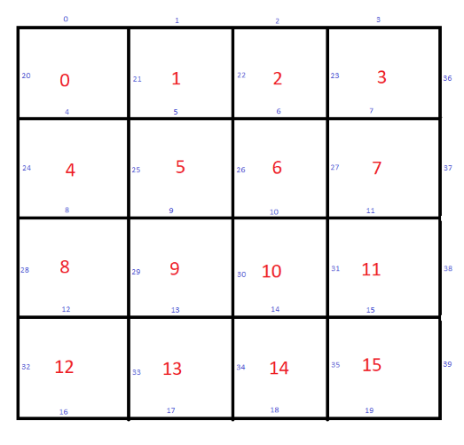

# dots-game
## Client/Server Dots game using Python Flask, Javascript, and CSS 

Links: [https://dotsgame.rickapps.com](https://dotsgame.rickapps.com) or [https://playdots.uc.r.appspot.com/](https://playdots.uc.r.appspot.com/)

For information on how to play the game, see: [https://en.wikipedia.org/wiki/Dots_and_Boxes](https://en.wikipedia.org/wiki/Dots_and_Boxes)

### Server Commands

1) Start a new game. Returns a web page depicting a gameboard of the specified size.

        POST /new/
        {
            size: size
        }
2) Resume a game in progress. Returns a web page depicting a gameboard of the specified state.

        POST /resume/
        {
            size: size,
            lines: lines[],
            claims: claims[]
        }

3) Determine the best move(s) for a gameboard of the specified state. Typically this would be the computer's turn in the game. Returns a list of tuples: **[(line#,box#,box#), (line#,box#,box#), ...]** where line# is the line the machine is adding. A single line can complete up to two boxes. Box#  is -1 if no box is complete, otherwise the box# of the completed box. As long as at least one box is completed, the machine adds an additional tuple to the list. The last tuple in the list will always have -1 for both box numbers.

        POST /find/
        {
            size: size,
            lines: lines[]
        }

4) Determine squares completed by a specified line. Typically this would be a player's move in the game. Returns a single tuple: **(line#,box#,box#)** using the same format as above. If both box#'s are -1, the player's turn has ended. If line# is -1, the game is over or the line was already taken.  

        POST /verify/
        {
            size: size,
            lines: lines[],
            line: line#
        }

5) Clear localStorage used by the game in the event of corruption or updates. Players are directed here in response to server errors. Once storage is cleared, a new game is started.

        GET /reset/

6) Normal entry-point to the game. If localStorage contains a game in progress, player is redirected to ***/resume/***. If no game is in progress, player is redirected to ***/new/***.

        GET /

### Definitions of terms used in the code

**claims[]:** A list of all boxes on the gameboard. If **claims[box#]** is 0, the box is not claimed. Values greater than zero are the player number of the box owner. Boxes are numbered according to the diagram below.

**history[]:** A list of all moves in the game. It is a list of lists of move tuples.

**lines[]:** The lines connecting the dots on the gameboard. **lines[line#]** is 1 if the line has been drawn or 0 if the line is available. Lines are numbered according to the diagram below. 

**move:** A move is a tuple (line#,box#,box#) where lines and boxes are numbered according to the diagram below. A player's turn can consist of multiple moves. A single line can complete up to two boxes. If a line completes a box, that player gets another move. (2, -1, -1) means no boxes were completed by drawing line#2. A move of (6, 2, -1) means line#6 completed box#2 and no other boxes. 

**size:** The number of squares on each side of the gameboard. The total number of squares is size**2. Note: The terms *boxes* and *squares* are used interchangeably. A gameboard of size three contains nine squares or boxes.

### Box and Line Numbering Scheme
 
The top left square has id=0. The bottom right square has id=squareCount-1. Each square has four sides; Top, Right, Bottom, and Left. If the square is complete it has a claim by the player that completed the box. All horizontal lines are numbered sequentially from the top left to the bottom right. The top segment of square zero is numbered zero, the top segment of square one is one, the bottom segment of square squareCount-1 is numbered (squareCount-1)+gameSize; Vertical lines are then numbered sequentially starting with the left side of square zero (The line id is squareCount+gameSize). However, vertical lines are not numbered sequentially all the way to the last column. Instead, the numbering ends at the right side of the square just before the last column. The vertical lines composing the outer right edge of the dot game board are not assigned numbers until all the other vertical lines are assigned. Then the right edge is numbered from top to bottom. 

For 4x4 game board, gameSize is 4. squareCount is 16. Squares are numbered 0-15. Horizontal lines on top edge of game board are numbered 0-3. Horizontal lines on bottom edge of game board are numbered 16-19. Vertical lines on the left edge are numbered 20,24,28,32. Vertical lines on the right edge of the game board are numbered 36,37,38,39. Vertical lines on the first row of the gameboard are numbered 20,21,22,23,36. The second row of vertical lines are numbered 24,25,26,27,37. The numbering scheme makes formulas for computing related squares and lines easier.

## Important Files

### startup.html, startup.js: 
Client entry point to the game. Normally the startup page is not seen by the user. When the page is loaded, localStorage is checked for an unfinished game. If found, the user is redirected to */resume/*. Otherwise, the user is redirected to */new/*. In the rare event the load script does not complete, the startup page is displayed. The user can click a link for */reset/*. 

### error.html:
The error page is displayed in response to server errors. The user is given the option to clear localStorage. New versions of this game sometimes change the file structure of localStorage. Clearing storage might fix certain server issues.

### mainpage.html, mainpage.js:
The dots game page and associated javascript functions that affect the user interface.

### dotsgame.js:
Javascript functions to communicate with the server, manage local storage, and other non-UI related functions.

### jsconstants.html:
This is where Flask jinja code passes values to javascript. The file also contains other javascript constants in all script files. 

### main.py
The Flask route. Entry point for the server.

### gameboard.py
A class to represent the dots game. This is the business logic to create the gameboard, find the best move, and game functions.

### dotgame.py
Interface functions between the gameboard class and the Flask route.

### themes.css
CSS variables defining colors and other values used in *style.css* and *layout.css*. You can define multiple sets of variables grouped by theme. The user can select different game themes to change the style of the UI.

### layout.css
Overall page structure and hamburger menu.

### style.css
Styles for *mainpage.html* and *startup.html.*

## Algorithm Overview
All game data is stored locally and managed by class **GameStorage**. Each time a player draws a line on the gameboard, an AJAX post is sent to the server passing the current *lines[]* array and the line the player added. The server responds with a tuple containing **(line#,box#,box#)** where *line#* is the line the player added, and *box#* is the square completed by the line. A single line can complete up to two squares on the gameboard. If both *box#'s* are -1, the player's turn ends and the the next player can move.  On the machine's turn, an AJAX post is made to the server passing the current *lines[]* array. The machine responds with a list of tuples; **[(line#,box#,box#), (line#,box#,box#), ...]**. If the machine's turn does not complete any boxes, the list contains only one entry, **[(line#,-1, -1)]**. If a move does complete at least one box, the machine draws another line and an additional tuple is added to the list.

All moves returned by the server, both for human players and for the machine, are stored locally in **GameStorage**. **GameStorage** maintains an up-to-date *lines[]* array, *claims[]* array, and player scores. **GameStorage** also maintains a *queue* array containing the moves to be drawn by the UI. The UI draws the moves at a timed, slow pace so the user can visually track each move. Once a move is drawn, it is discarded from the queue. A player can close the web page at anytime and the current state of the game is stored in **GameStorage.lines** and **GameStorage.claims**. The next time the game page is displayed, it will be restored to its previous state. 

The gameboard UI posts player moves to the server and it slowly draws all moves stored in **GameStorage.queue**. Once the moves are drawn, they are deleted from **GameStorage.queue**. The gameboard UI waits either waits for a player to draw another line or it requests a move from the server. Which action it takes depends  on who has the current turn. The server determines when turns change and that information is stored in **GameStorage.queue**. 

